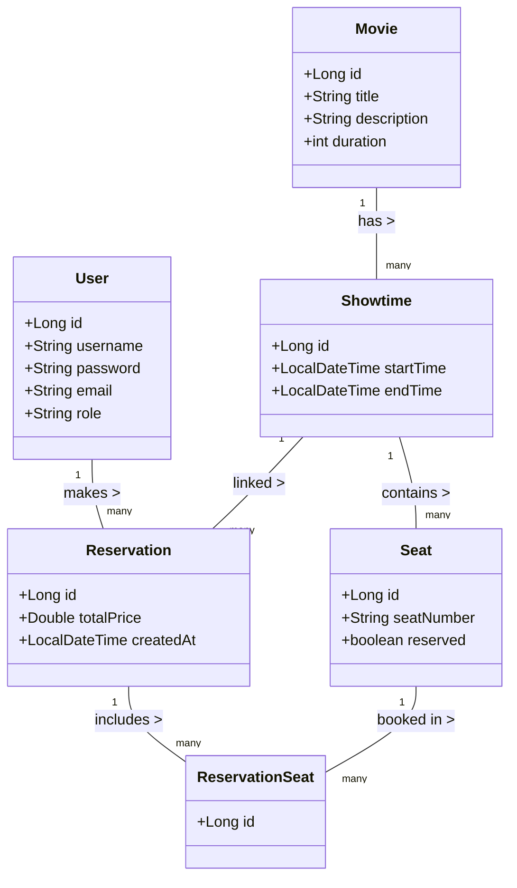

# Movie Reservation System 

This project is a RESTful backend for a **Movie Reservation System** built with **Spring Boot**, **Spring Data JPA**, **Spring Security with JWT**, and **PostgreSQL**. It enables users to browse movies, view showtimes, and reserve seats securely.  

## Features

- **User Authentication:**
  - **Registration & Login:** Users register and log in to obtain a JWT token.
  - **Role-based Access:** Default role is **USER**, while **ADMIN** has elevated privileges.
- **Movie Management:**
  - **Public Endpoints:** View movies and showtimes.
  - **Admin Endpoints:** Create, update, and delete movies and showtimes.
- **Seat Reservation:**
  - Users can select available seats for a showtime and reserve them.
  - Seat locking ensures no double booking.
- **Reservation Management:**
  - Users can view their past and upcoming reservations.
  - Admins can view all reservations.
- **Additional Modules (for future extension):**
  - Payment Integration.
  - Discount Coupons.
  - Notifications (Email/SMS).
  - Seat Recommendation Engine.
- **Error Handling:**
  - This project uses a centralized Global Exception Handler (@RestControllerAdvice) to ensure all errors are returned in a consistent JSON format.

---

## Architecture & Entity Relationships

The project follows a layered architecture with controllers, services, repositories, DTOs, and mappers.  

### UML Diagram

-----
## Technologies Used

- Java 21
- Spring Boot
- Spring Data JPA
- Spring Security with JWT
- PostgreSQL
- Lombok
- BCrypt for password hashing
- Maven
---
## API Endpoints

# Authentication (/api/auth)
- POST /api/auth/register → Register a new user
- POST /api/auth/login → Authenticate user & get JWT

# Movies (/api/movies)
- GET /api/movies → Get all movies
- GET /api/movies/{id} → Get movie details by ID
- POST /api/movies → Add a new movie (Admin only)
- PUT /api/movies/{id} → Update movie (Admin only)
- DELETE /api/movies/{id} → Delete movie (Admin only)

# Reservations (/api/reservations)
- POST /api/reservations → Reserve seats (User must be logged in with JWT)
- GET /api/reservations/user/{userId} → Get all reservations for a user (secured, only the same user or admin can access)
-----
