# 🎬 Movie Reservation System

---

## 🚀 Project Overview
This project is a RESTful backend for a **Movie Reservation System** built with **Spring Boot**, **Spring Data JPA**, **Spring Security with JWT**, and **PostgreSQL**. It enables users to browse movies, view showtimes, and reserve seats securely.  

---

## Features

- **User Authentication:**
  - **Registration & Login:** Users register and log in to obtain a JWT token.
  - **Role-based Access:** Default role is **USER**; **ADMIN** can add and delete movies.
- **Movie Management:**
  - **Public Endpoints:** View movies (list and details).
  - **Admin Endpoints:** Create and delete movies.
- **Seat Reservation:**
  - Users can select available seats for a showtime and reserve them.
  - Seat locking ensures no double booking (uses transactional and pessimistic locking).
- **Reservation Management:**
  - Users can view their own reservations.
- **Error Handling:**
  - Centralized Global Exception Handler (`@RestControllerAdvice`) ensures all errors are returned in a consistent JSON format.
- **Extensible Design:**
  - The codebase is modular and ready for future extensions such as payment integration, discount coupons, notifications, or seat recommendation engine (not implemented yet).

---

## 🏗️ System Architecture

---
## 📊 Data Model (ER Diagram)

```mermaid
erDiagram
  USER ||--|{ RESERVATION : "makes"
  MOVIE ||--|{ SHOWTIME : "has"
  SHOWTIME ||--|{ SEAT : "offers"
  SHOWTIME ||--|{ RESERVATION : "receives"
  RESERVATION ||--|{ RESERVATIONSEAT : "includes"
  SEAT ||--|{ RESERVATIONSEAT : "is_reserved_in"

  USER {
    Long id
    String username
    String email
    String password
    String role
  }
  MOVIE {
    Long id
    String title
    String description
    String posterUrl
    String genre
  }
  SHOWTIME {
    Long id
    Long movie_id
    Timestamp start_time
  }
  SEAT {
    Long id
    Long showtime_id
    String seat_number
  }
  RESERVATION {
    Long id
    Long user_id
    Long showtime_id
    Timestamp reserved_at
  }
  RESERVATIONSEAT {
    Long id
    Long reservation_id
    Long seat_id
  }
```

---

## 🔐 Authentication Flow

---

## ✅ API Endpoints
### Authentication (`/api/auth`)
- POST `/api/auth/register` → Register a new user
- POST `/api/auth/login` → Login & get JWT

### Users (`/api/users`)
- GET `/api/users/profile` → Get current user profile
- PUT `/api/users/profile` → Update profile

### Movies (`/api/movies`)
- GET `/api/movies` → List all movies
- POST `/api/movies` → Add a new movie (admin)
- PUT `/api/movies/{id}` → Update a movie (admin)
- DELETE `/api/movies/{id}` → Delete a movie (admin)

### Showtimes (`/api/showtimes`)
- GET `/api/showtimes/{movieId}` → List showtimes for a movie
- POST `/api/showtimes` → Add a showtime (admin)

### Reservations (`/api/reservations`)
- POST `/api/reservations` → Reserve seats
- GET `/api/reservations` → List user reservations

-----
## Technologies Used

- Java 21
- Spring Boot
- Spring Data JPA
- Spring Security with JWT
- PostgreSQL
- Lombok
- BCrypt for password hashing
- Maven
---

