# Movie Reservation System 

This project is a RESTful backend for a **Movie Reservation System** built with **Spring Boot**, **Spring Data JPA**, **Spring Security with JWT**, and **PostgreSQL**. It enables users to browse movies, view showtimes, and reserve seats securely.  

## Features

- **User Authentication:**
  - **Registration & Login:** Users register and log in to obtain a JWT token.
  - **Role-based Access:** Default role is **USER**, while **ADMIN** has elevated privileges.
- **Movie Management:**
  - **Public Endpoints:** View movies and showtimes.
  - **Admin Endpoints:** Create, update, and delete movies and showtimes.
- **Seat Reservation:**
  - Users can select available seats for a showtime and reserve them.
  - Seat locking ensures no double booking.
- **Reservation Management:**
  - Users can view their past and upcoming reservations.
  - Admins can view all reservations.
- **Error Handling:**
  - This project uses a centralized Global Exception Handler (@RestControllerAdvice) to ensure all errors are returned in a consistent JSON format.
- **Additional Modules (for future extension):**
  - Payment Integration.
  - Discount Coupons.
  - Notifications (Email/SMS).
  - Seat Recommendation Engine.
---## 🏗️ System Architecture

```mermaid
flowchart LR
    subgraph Client["🛠️ API Client (Postman, curl)"]
        APIClient["API Consumer"]
    end
    subgraph Server["⚙️ Backend (Spring Boot)"]
        AuthController
        MovieController
        ReservationController
        UserService
        MovieService
        ReservationService
        SecurityLayer
        ExceptionHandler
    end
    subgraph DB["🗄 Database (e.g., PostgreSQL)"]
        UserTable[(users)]
        MovieTable[(movies)]
        ShowtimeTable[(showtimes)]
        SeatTable[(seats)]
        ReservationTable[(reservations)]
        ReservationSeatTable[(reservation_seats)]
    end
    APIClient --> AuthController
    APIClient --> MovieController
    APIClient --> ReservationController
    AuthController --> UserService
    MovieController --> MovieService
    ReservationController --> ReservationService
    UserService --> UserTable
    MovieService --> MovieTable
    MovieService --> ShowtimeTable
    MovieService --> SeatTable
    ReservationService --> ReservationTable
    ReservationService --> ReservationSeatTable
    ReservationService --> SeatTable
    SecurityLayer --> UserService
    ExceptionHandler --> Server
```


---

## 📊 Data Model (ER Diagram)

---

## 🔐 Authentication Flow
```mermaid
sequenceDiagram
  participant User
  participant APIClient
  participant Backend
  participant AuthService
  participant UserRepo

  User ->> APIClient: Enter email + password  
  APIClient ->> Backend: POST /api/auth/login  
  Backend ->> AuthService: Validate credentials  
  AuthService ->> UserRepo: Retrieve user data  
  UserRepo -->> AuthService: User found  
  AuthService ->> AuthService: Generate JWT  
  AuthService -->> Backend: Return JWT  
  Backend -->> APIClient: Send token + user info  
  APIClient: Save JWT for future requests  
```
---

## ✅ API Endpoints
### Authentication (`/api/auth`)
- POST `/api/auth/register` → Register a new user
- POST `/api/auth/login` → Login & get JWT

### Users (`/api/users`)
- GET `/api/users/profile` → Get current user profile
- PUT `/api/users/profile` → Update profile

### Movies (`/api/movies`)
- GET `/api/movies` → List all movies
- POST `/api/movies` → Add a new movie (admin)
- PUT `/api/movies/{id}` → Update a movie (admin)
- DELETE `/api/movies/{id}` → Delete a movie (admin)

### Showtimes (`/api/showtimes`)
- GET `/api/showtimes/{movieId}` → List showtimes for a movie
- POST `/api/showtimes` → Add a showtime (admin)

### Reservations (`/api/reservations`)
- POST `/api/reservations` → Reserve seats
- GET `/api/reservations` → List user reservations

---

-----
## Technologies Used

- Java 21
- Spring Boot
- Spring Data JPA
- Spring Security with JWT
- PostgreSQL
- Lombok
- BCrypt for password hashing
- Maven
---

